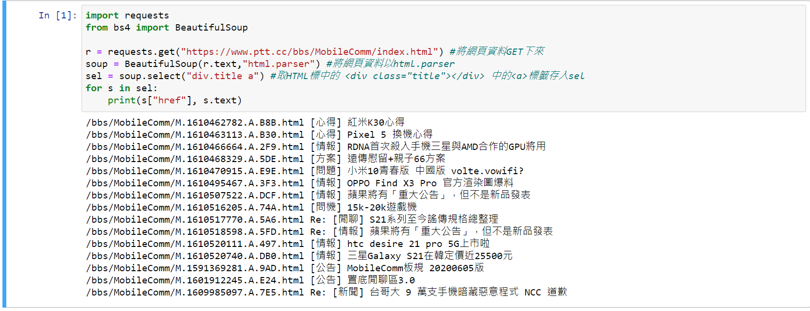

#執行前準備
1.Python 環境

2.pip 10.0.0

3.pip install jupyter notebook  ，一個讓你可以寫code的工具

4.pip install requests  ,對網路發動請求的套件，可實作對網頁做get、post等HTTP協定的行為

5.pip install beautifulsoup4  ,借助網頁的結構特性來解析網頁的工具

補:本人使用Amaconda 3 (有包含以上套件，所以沒有而外下載)


# 爬蟲

``````
import requests
from bs4 import BeautifulSoup

r = requests.get("https://www.ptt.cc/bbs/MobileComm/index.html") #將網頁資料GET下來
soup = BeautifulSoup(r.text,"html.parser") #將網頁資料以html.parser
sel = soup.select("div.title a") #取HTML標中的 <div class="title"></div> 中的<a>標籤存入sel
for s in sel:
    print(s["href"], s.text)
```````

#執行結果


